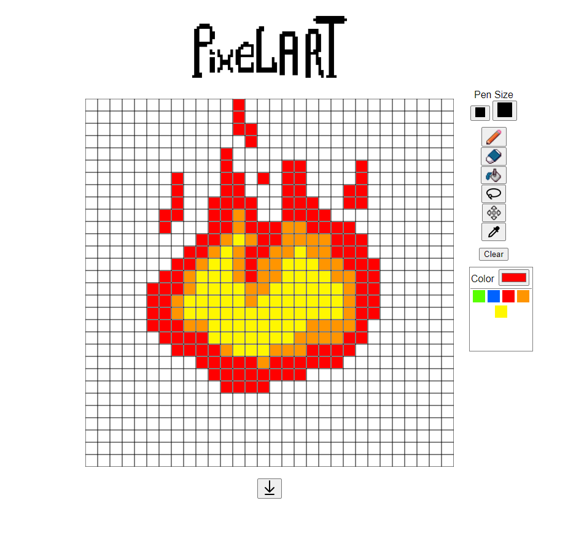

## PixElArt

Online pixel art editor. Built with JavaScript using Canvas API

### What can be improved:
- change CSS code to be able to use the selection tool
  Goal : be able to select and move one or multiple cells (and animate the movement).
  
  I wanted to use another canvas as a top layer, to draw and later erase the animations,
  but a conflict between the CSS and JS made it impossible to do.
  It made me realize that my CSS needs to be fixed.
